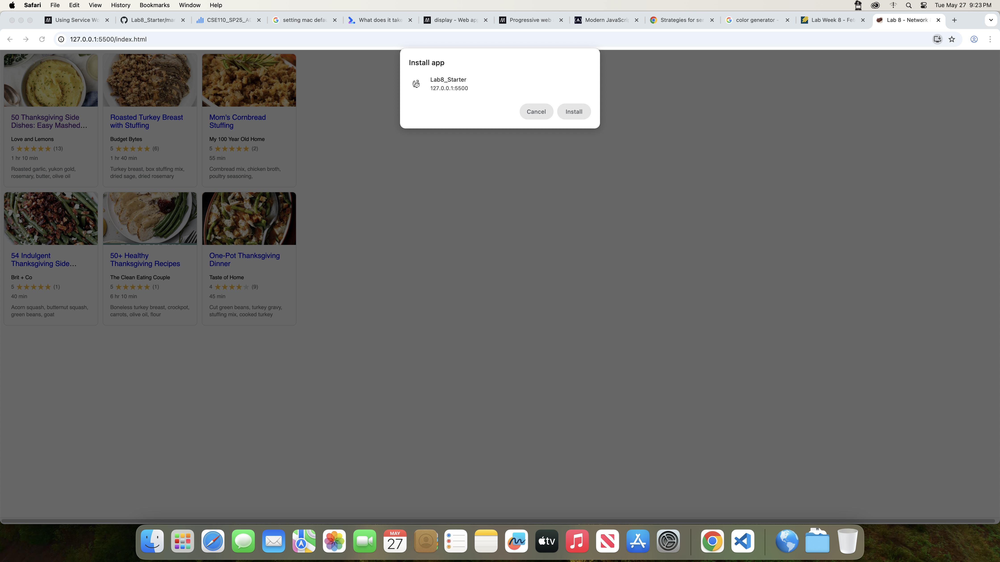

# Lab8-Starter
Angelica Cabusi\
https://lyka717.github.io/Lab8_Starter/

Graceful degredation is when used to handle performance and functionality of an application when some components start to fail or degrade. Service workers are to help parts 
of an application run effectively, such as remembering calls in order to avoid needing to actually create a new call, as well as help 
other things run in the background in order to deal with JavaScript's process of just running one thing at a time. Ultimately, service workers can be 
a tool in graceful degredation as they both have the same goal, or handle the same problem, of having the application function despite slow network requests.
